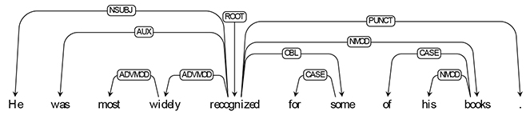
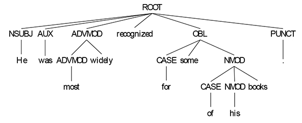

# Introduction
This repository contains the code for "_U-DepPLLaMA: Universal Dependency Parsing via Auto-regressive Large Language Models_" published in the _Italian Journal of Computational Linguistics_ by Claudiu Daniel Hromei, Danilo Croce and Roberto Basili, University of Rome Tor Vergata. The paper is available [here](https://www.ai-lc.it/wp-content/uploads/2024/08/IJCOL_10_1_2_hromei_et_al.pdf).

The paper explores the capabilities of Large Language Models (LLMs) like LLaMA in syntactic parsing tasks. We introduce `U-DepPLLaMA`, a novel architecture that treats Dependency Parsing as a sequence-to-sequence problem, achieving state-of-the-art results in **26 languages** from the **Universal Dependency Treebank**. Our approach demonstrates that LLMs can handle dependency parsing without the need for specialized architectures, showing robust performance even with complex sentence structures.

The idea is that we can automatically derive the dependency parsing formula of a given sentence. For example, the sentence

    “He was most widely recognized for some of his books.”

is associated with the following Dependency Graph



which can easily be transformed in the following Parse Tree



To do so, we utilize the LLaMA2 family model to produce, given the input sentence, the following output sentence

    [ROOT[NSUBJ[He ]] [AUX [was ]] [ADVMOD [ADVMOD [most ]] [widely ]] [recognized ] [ OBL [CASE [for ]] [some ] [NMOD [CASE [of ]] [NMOD [his ]] [books ]]] [PUNCT [. ]]]

By using [this](sentence_utils.py) code, we can easily derive the Parse Tree of the sentence from the textual output and viceversa. If you need to train your own LLM, you can use the above script to convert from the parenthetical form to the [conllu](https://pypi.org/project/conllu/) format and viceversa.


The trained models are available on the [Huggingface repository](https://huggingface.co/sag-uniroma2).

<!-- # Dataset
In our experiments, we narrowed our focus to the [Universal Dependency Parsing dataset version 2.3](http://hdl.handle.net/11234/1-2895). From the Universal Dependency Parsing dataset, our concentration was particularly on the subset whose languages were supported by LLaMA2, as indicated in their report. This subset included 27 languages, from English and Finnish to Korean. Unfortunately, we discarded texts written in Vietnamese because we encountered problems with encoding and the LLaMA2 tokenizer. Our dataset thus contains examples written in 26 languages. For languages like Czech, Norwegian, and Russian with over 30,000 examples, we limit the training datasets to a maximum of 30,000 sentences per language, retaining balanced datasets across languages. Our neural architecture was trained on the aggregated dataset of all supported languages after the cutoff reduction, which consisted of 392,088 training examples, 59,084 development sentences, and 62,069 testing examples
-->

# Install required libraries 
0. Clone this repository
```Shell
git pull https://github.com/crux82/u-deppllama
cd udeppllama
```

1. Create Environment and Install Packages
```Shell
conda create --name udeppllama python=3.10 -y 
conda activate udeppllama
pip install -r requirements.txt
```

# How to use it
```Python
import transformers
import torch
from transformers import BitsAndBytesConfig, AutoModelForCausalLM, AutoTokenizer, GenerationConfig
from peft import PeftModel

quant_config = BitsAndBytesConfig(
    load_in_4bit=True,
    bnb_4bit_use_double_quant=True,
    bnb_4bit_quant_type="nf4",
    bnb_4bit_compute_dtype=torch.bfloat16
)

model = AutoModelForCausalLM.from_pretrained(
            "meta-llama/Llama-2-13b-hf",
            load_in_4bit=True,
            quantization_config=quant_config,
            torch_dtype=torch.float16,
            trust_remote_code=True,
            device_map={"": 0},
        )
model = PeftModel.from_pretrained(
            model,
            "sag-uniroma2/u-depp-llama-2-13b"
        )

generation_config = GenerationConfig(
        num_beams=4,
        do_sample=False,
        early_stopping=True,
    )

tokenizer = AutoTokenizer.from_pretrained("meta-llama/Llama-2-13b-hf", trust_remote_code=True)

input_string = "He was most widely recognized for some of his books."
prompt = f"""
### Input:
{input_string}
### Answer:"""

inputs = tokenizer(prompt, return_tensors="pt", padding=True, truncation=True, max_length=512)
input_ids = inputs["input_ids"].to(model.device)

with torch.no_grad():
    gen_outputs = model.generate(
        input_ids=input_ids,
        generation_config=generation_config,
        return_dict_in_generate=True,
        output_scores=True,
        max_new_tokens=1024,
        use_cache=True,
    )
s = gen_outputs.sequences[0]
output = tokenizer.decode(s, skip_special_tokens=True)

response = output.split("### Answer:")[1].rstrip().lstrip()
print(response)
```

# Notes
This software is released as is, along with the [LLaMA](https://ai.meta.com/llama/license/) and [UD](https://github.com/UniversalDependencies/LICENSE) licenses.

# Citation
```
@article{hromei2024udeppllama,
  author  = "Hromei, Claudiu Daniel and Croce, Danilo and Basili, Roberto",
  title   = "U-DepPLLaMA: Universal Dependency Parsing via Auto-regressive Large Language Models",
  journal = "IJCoL",
  year    = 2024,
  volume  = "10",
  number  = "1",
  pages   = "21--38"
}
```
